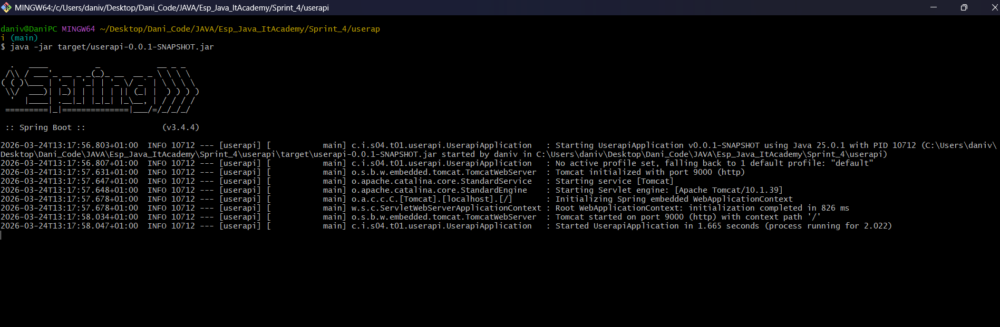
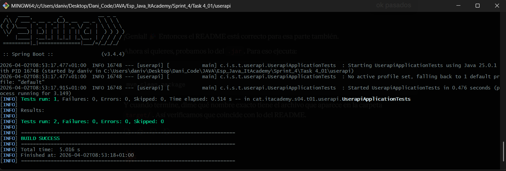

# S4.01 — Spring Boot Introduction
## Project Goal & Overview

The goal of this project is to build a **first REST API** using Spring Boot, verifying that the application starts correctly and responds as expected.

This repository covers the creation of a basic health check endpoint, tested in three different ways:

- verifying the response directly from the browser
- sending HTTP requests with Postman
- automating the verification with a unit test

---

## 🧩 LEVEL 1 — First REST API

### 📌 Exercise 1 — Health Check Endpoint

A **health check** endpoint is a common pattern in real-world systems to verify that an application is alive and functional. This exercise implements a simple `GET /health` endpoint that returns a structured JSON response.

The system must:
- expose a `GET /health` endpoint via a `@RestController`
- return a JSON object `{ "status": "OK" }` instead of plain text
- be verifiable from the browser, Postman, and automated tests

#### Class Structure

| Class | Role |
|---|---|
| `UserapiApplication` | Spring Boot entry point — bootstraps the application |
| `HealthController` | REST controller exposing the `/health` endpoint |
| `Status` | Java record used as the JSON response body |

#### Endpoint

| Method | URL | Response |
|---|---|---|
| `GET` | `http://localhost:9000/health` | `{ "status": "OK" }` |

#### Example Response

```json
{
  "status": "OK"
}
```

#### How to verify

**From the browser:**
Start the application and navigate to:
```
http://localhost:9000/health
```

**From Postman:**
- Method: `GET`
- URL: `http://localhost:9000/health`
- Press **Send** and verify the JSON response body

**From the terminal (as executable `.jar`):**
```bash
mvn clean package
java -jar target/userapi-0.0.1-SNAPSHOT.jar
```

---

### 🧪 Unit Test

A web layer test using `@WebMvcTest` verifies the endpoint without starting the full application context.

| Test | Description |
|---|---|
| `shouldReturnOkStatus` | Simulates a `GET /health` request and verifies the HTTP status is `200 OK` and the JSON body contains `"status": "OK"` |

---
Image of connection:


Image of pass tests:

---

## 🛠 Technologies

- ☕ Java 25
- 🌱 Spring Boot 3.4.4
- 🧪 JUnit 5 + MockMvc
- 🏗️ Maven
- 🐙 Git & GitHub

---

## 🚀 Installation and Execution

### Prerequisites

- Java Development Kit (JDK) 17+
- Maven (or use the included Maven Wrapper)

### Steps

1. **Clone the repository:**
   ```bash
   git clone https://github.com/Dani87dev/S4T1_Spring_Boot_Introduction.git
   ```

2. **Navigate to the project folder:**
   ```bash
   cd S4T1_Spring_Boot_Introduction
   ```

3. **Run the application:**
   ```bash
   ./mvnw spring-boot:run
   ```
   The server will start on port **9000**.

4. **Run the tests:**
   ```bash
   ./mvnw test
   ```
